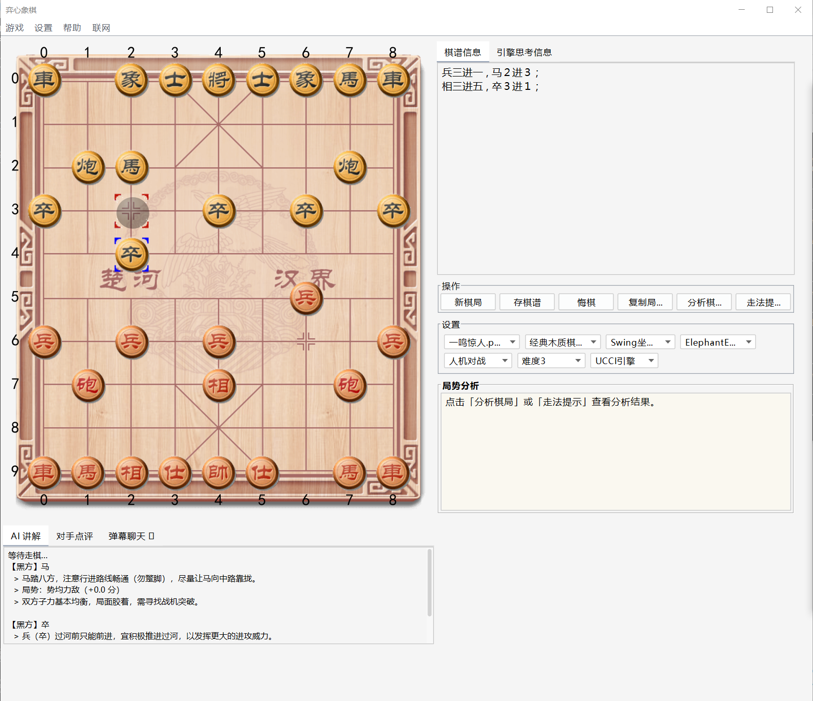

# 弈心象棋 (YiXin Chinese Chess)

一款基于 Java Swing 的中国象棋对弈软件，支持人机对战、AI 互战、双人对战和在线联网对战。



---

## 功能特性

### 对战模式

| 模式 | 说明 |
|:---|:---|
| **人机对战** | 与 AI 对弈，可选择 UCCI 协议外部引擎或内置本地 AI |
| **AI 对战** | 让两个 AI 自动对弈，观棋学习 |
| **双人对战** | 在同一台电脑上轮流操作 |
| **在线对战** | 通过 TCP 服务器进行联网 PvP 对战，支持观战模式 |
| **在线弹幕** | 对局时发送弹幕/聊天消息，浮动显示在棋盘上 |

### AI 引擎

- **本地 AI** — 纯 Java 实现的 Minimax + Alpha-Beta 剪枝搜索，深度 1–6 级可调，附带位置评估表
- **UCCI 引擎** — 支持通用中国象棋协议 (UCCI)，内置 8 款引擎（ElephantEye、云中象、兵河五四、决战象棋等），可按需扩展
- **AI 讲解** — AI 走棋后自动分析局势、评分，给出策略建议
- **对手点评** — 人类走棋后 AI 即时评价走法质量（妙/优/平/疑/劣），含吃子分析和专项策略提示
- **局势分析** — 随时请求 AI 深度分析当前局面，显示评分、深度、最佳变例
- **走法提示** — AI 给出当前最佳走法并自动落子

### 界面定制

- **棋盘主题** — 内置 70+ 款精美棋盘背景（国风山水、赛事主题等），支持带网格/纯背景切换
- **棋子风格** — 内置 110+ 款棋子样式（3D、木质、玉石、金边、卡通、水晶玻璃等）
- **坐标系统** — 支持传统中文坐标、ICCS 坐标、Swing 坐标系三种显示方式
- **棋子动画** — 平滑缓动移动动画效果
- **将军高亮** — 脉冲光圈 + 旋转虚线 + 四向尖刺组合特效
- **绝杀特效** — 粒子爆发 + 扩散光圈 + 渐变文字光晕全屏覆盖层

### 其他功能

- **棋谱管理** — 保存对局为 PGN 格式文件，随时复盘
- **悔棋** — 撤销上一步操作
- **局面复制** — 将当前局面导出为 FEN 字符串
- **音效系统** — 走子、吃子、将军、胜负、开局等 12 种音效，支持 MP3 背景音乐
- **配置持久化** — 棋盘、棋子、引擎等设置通过 `chessConfig.ini` 持久化

---

## 技术栈

| 层次 | 技术 |
|:---|:---|
| 编程语言 | Java 8 |
| UI 框架 | Swing + FlatLaf (Arc-Orange 主题) |
| 构建工具 | Maven |
| 事件驱动 | GreenRobot EventBus |
| AI 引擎 | 本地 Minimax / UCCI 协议 |
| 网络通信 | TCP Socket + Gson (JSON) |
| 日志 | SLF4J + Logback |
| 配置 | ini4j |
| 音效 | javax.sound + JLayer (MP3) |

---

## 环境要求

- JDK 8 或更高版本
- Maven 3.6+

---

## 快速开始

### 构建打包

```bash
# 方法一：使用打包脚本（推荐）
双击 package.bat

# 方法二：手动构建
mvn clean package -DskipTests
```

构建完成后在 `target/` 目录下生成 `openUcciChineseChess-0.0.1-SNAPSHOT-jar-with-dependencies.jar`（含所有依赖的 fat JAR）。

### 运行

```bash
# 方式一：从 target 目录直接运行
java -jar target\openUcciChineseChess-0.0.1-SNAPSHOT-jar-with-dependencies.jar

# 方式二：使用打包脚本生成的可执行包
# 进入 dist 目录后双击或运行：
cd dist
run_single.bat    # 单机
run_multi.bat     # 双实例联机对战
```

---

## 在线对战

### 本地双人测试

1. 启动游戏，点击菜单 **联网 → 联网大厅**
2. 在登录窗口填入服务器地址 `127.0.0.1:9527`，点击 **「启动本地服务器」**
3. 输入用户名和密码，先点 **「注册」**，再点 **「登录」**，进入大厅
4. 点击 **「创建 PvP 房间」**，输入房间名，等待对手加入
5. 启动第二个游戏实例，用不同用户名登录，加入房间
6. 双方开始对弈，红方先行

### 局域网对战

1. 选一台电脑作为服务端，启动应用后开启本地服务器
2. 其他电脑将服务器地址改为该电脑的 **局域网 IP**（如 `192.168.1.100`），端口 `9527`
3. 其余步骤与本地测试相同

### 防火墙设置

如果局域网其他电脑连接不上，在服务端放行端口：

```cmd
netsh advfirewall firewall add rule name="ChessServer" dir=in action=allow protocol=TCP localport=9527
```

### 观战模式

1. 用第三个账号登录
2. 进入大厅，选中进行中的房间
3. 点击 **「观战」**，自动回放历史棋步，之后实时同步

---

## 项目结构

```
openUcciChineseChess/
│
├── src/main/java/com/ctgu/
│   ├── Application.java              # 程序入口
│   │
│   ├── config/                       # 配置管理
│   │   ├── Config.java               # 配置读写封装
│   │   └── ChessConfig.java          # Ini4j 配置实体
│   │
│   ├── constant/
│   │   └── ChessConstant.java        # 全局常量（棋盘/棋子/引擎/坐标定义）
│   │
│   ├── controller/
│   │   ├── ChessController.java      # 游戏控制器（引擎交互、走法记录、分析请求）
│   │   └── ChessRules.java           # 象棋规则引擎（走法生成、合法性校验、将军检测）
│   │
│   ├── engine/
│   │   ├── UcciEngine.java           # UCCI 协议引擎（进程通信、异步思考）
│   │   ├── LocalAiEngine.java        # 本地 Minimax AI（Alpha-Beta 剪枝，深度 1-6）
│   │   └── EngineMonitor.java        # 引擎回调接口
│   │
│   ├── enums/
│   │   ├── Piece.java                # 棋子枚举（类型 + 颜色）
│   │   ├── PieceColor.java           # 棋子颜色
│   │   ├── Side.java                 # 红方/黑方
│   │   ├── GameMode.java             # 对战模式（人机/AI对战/双人/在线对战/在线观战）
│   │   ├── GameOverType.java         # 终局类型（胜/负/平）
│   │   └── ChessAudio.java           # 音效枚举
│   │
│   ├── event/
│   │   └── EventMessage.java         # EventBus 事件消息
│   │
│   ├── model/
│   │   ├── Move.java                 # 走法（ICCS 坐标）
│   │   ├── Position.java             # 局面（棋盘数组 + 行棋方 + FEN 转换）
│   │   ├── GameContext.java          # 游戏上下文（历史局面、棋谱、FEN 命令）
│   │   ├── MoveCounter.java          # 走子计数
│   │   ├── AnalysisResult.java       # 分析结果
│   │   └── IniFileEntity.java        # INI 配置实体
│   │
│   ├── network/
│   │   ├── ChessServer.java          # TCP 服务器（登录/注册/房间管理/消息路由）
│   │   ├── ChessClient.java          # TCP 客户端（单例，连接/发送/接收）
│   │   ├── NetMessage.java           # 网络消息协议（JSON 序列化）
│   │   ├── MessageType.java          # 消息类型定义
│   │   └── RoomInfo.java             # 房间信息
│   │
│   ├── pieces/
│   │   ├── King.java                 # 帅/将走法规则
│   │   ├── Advisor.java              # 仕/士走法规则
│   │   ├── Bishop.java              # 相/象走法规则
│   │   ├── Knight.java              # 马走法规则
│   │   ├── Rook.java                # 车走法规则
│   │   ├── Cannon.java              # 炮走法规则
│   │   └── Pawn.java                # 兵/卒走法规则
│   │
│   ├── util/
│   │   ├── ChessFenUtil.java         # FEN 字符串工具
│   │   ├── ChessNotationUtil.java    # 传统中国象棋记谱（炮二平五、马8进7）
│   │   ├── FileUtil.java             # 文件读写工具
│   │   ├── IniFileUtil.java          # INI 文件解析
│   │   ├── ImageMerger.java          # 图片合并工具
│   │   ├── ClipBoardUtil.java        # 剪贴板工具
│   │   ├── StringUtil.java           # 字符串工具
│   │   └── ReflectUtil.java          # 反射工具
│   │
│   └── view/
│       ├── ChessFrame.java           # 主窗口（菜单栏 + 布局）
│       ├── ChessPanel.java           # 核心面板（棋盘绘制、交互、AI调度、联网对战）
│       ├── LoginDialog.java          # 登录对话框（服务器/端口/注册/登录）
│       ├── LobbyDialog.java          # 在线大厅（房间列表/创建/加入/观战）
│       ├── ListDialog.java           # 选择对话框（棋盘/棋子设置）
│       ├── Dialog.java               # 通用文本对话框
│       ├── ToastFrame.java           # Toast 气泡提示
│       ├── DanmuPanel.java           # 弹幕浮层面板
│       └── CheckmateOverlayPanel.java # 绝杀全屏特效覆盖层
│
├── src/main/resources/
│   ├── boards/                       # 棋盘图片（70+ 款）
│   ├── pieces/                       # 棋子图片（110+ 种风格）
│   ├── sounds/                       # 音效文件（WAV + MP3 背景音乐）
│   ├── engines/                      # UCCI 引擎集合（Coony, ElephantEye, HIce 等）
│   ├── config/                       # 引擎配置
│   ├── about.txt                     # 关于对话框内容
│   └── logback.xml                   # 日志配置
│
├── engines/ElephantEye/              # 外部引擎目录
│   └── ELEEYE.EXE                    # ElephantEye UCCI 引擎
│
├── pic/
│   └── ScreenShot_2026-04-28_185551_376.png  # 主界面截图
│
├── pom.xml                           # Maven 构建配置
├── chessConfig.ini                   # 用户配置文件
├── package.bat                       # 打包脚本
├── test_online.bat                   # 联机测试脚本
└── README.md                         # 本文档
```

---

## 配置

配置文件 `chessConfig.ini`：

```ini
[ui]
board = 0           ; 棋盘索引
pieces = 0          ; 棋子索引
coordinate = 2      ; 坐标模式: 0=传统, 1=ICCS, 2=Swing

[engine]
engine = 0          ; 引擎索引
timeLimit = 500     ; AI 思考时间限制（毫秒）

[operate]
computerFirst = false   ; AI 是否先手
playBgSound = false     ; 是否播放背景音乐
```

---

## 扩展 UCCI 引擎

1. 将引擎可执行文件放入 `src/main/resources/engines/<引擎名>/` 目录
2. 在 `ChessConstant.java` 的 `ENGINE_NAME` 数组中添加引擎路径（相对于 `engines/` 目录）
3. 重新打包即可在游戏内切换使用

---

## 消息协议（网络对战）

所有消息格式为 JSON，通过 TCP（默认端口 `9527`）传输。

### 客户端 → 服务端

| type | data 字段 | 说明 |
|:---|:---|---|
| `register` | `username`, `password` | 注册新用户 |
| `login` | `username`, `password` | 登录 |
| `get_rooms` | — | 获取房间列表 |
| `create_room` | `name`, `mode` | 创建房间（`pvp`/`ai`） |
| `join_room` | `roomId` | 加入房间对战 |
| `spectate` | `roomId` | 进入房间观战 |
| `move` | `roomId`, `move` | 发送走法 |
| `chat` | `roomId`, `text` | 发送弹幕/聊天 |
| `leave_room` | `roomId` | 离开房间 |
| `heartbeat` | — | 心跳保活 |

### 服务端 → 客户端

| type | data 字段 | 说明 |
|:---|:---|---|
| `reg_ok` | — | 注册成功 |
| `reg_err` | `msg` | 注册失败 |
| `login_ok` | `username` | 登录成功 |
| `login_err` | `msg` | 登录失败 |
| `room_list` | `rooms[]` | 房间列表 |
| `room_created` | `room` | 房间创建成功 |
| `room_joined` | `room`, `side` | 加入成功 |
| `spectate_ok` | `room`, `moves[]` | 观战成功，附历史走法 |
| `game_start` | `roomId`, `redPlayer`, `blackPlayer` | 游戏开始 |
| `opp_move` | `roomId`, `move` | 对手走法 |
| `chat_msg` | `roomId`, `username`, `text` | 弹幕消息 |
| `game_over` | `roomId`, `winner`, `reason` | 游戏结束 |
| `player_left` | `roomId`, `username` | 玩家离开 |
| `room_update` | `room` | 房间状态更新 |
| `error` | `msg` | 通用错误 |

---

## 许可协议

本项目基于 GPL-3.0 协议开源。

## 联系方式

- 开发者：lihuahui
- 邮箱：2110931055@qq.com
