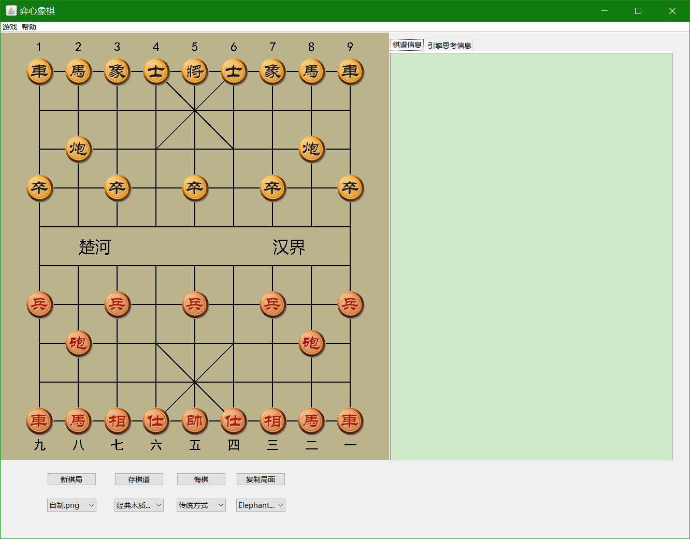

# openUcciChineseChess

#### 介绍
### Java程序实现的UCCI引擎的界面程序 

Java版中国象棋游戏。通过调用UCCI引擎实现，界面如下： 

#### 说明
本程序使用Java Swing开发，已基本开发完成，具体实现的功能如下： 
1、象棋所有棋子走棋规则检测； 
2、本地UCCI引擎的调用与结果实时读取； 
3、人机对战功能； 
4、棋谱和引擎通信日志记录功能； 
5、最终输赢判断， 
8、棋盘背景、棋子风格和棋盘坐标的自由更换功能，其中棋盘背景共25套，象棋棋子共104套，棋盘坐标风格共三种； 

####【开源协议】
本项目基于 GPL v3 协议开源，详情请查看 GPL-v3-License.txt

